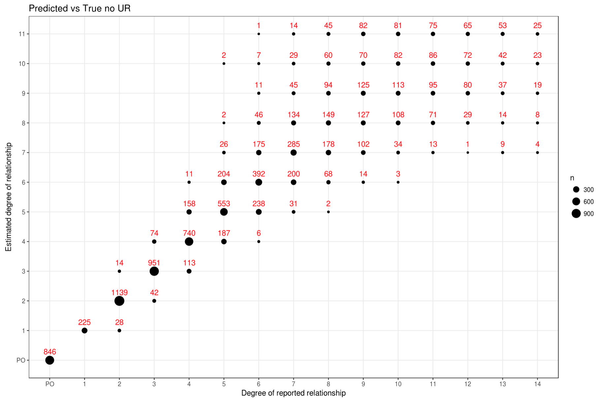

TRIBES
======
*TRIBES* is a user-friendly platform for relatedness detection in genomic data.
*TRIBES* is the first tool which is both accurate (up to 7th degree) and
combines essential data processing steps in a single platform.

Accurately classifying the degree of relatedness between pairs of individuals
has multiple important applications, including disease gene discovery, removal
of confounding relatives in genome wide association studies (GWAS) and family
planning. Currently no tools are available which are accurate beyond 3rd degree
and combine the necessary data processing steps for accuracy and ease of use.
To address this we have developed ‘*TRIBES*’, a user-friendly platform which
leverages the GERMLINE algorithm to accurately identify distant relatives.
*TRIBES* enables user-guided data pruning, phasing of genomes, IBD segment
recovery, masking of artefactual IBD segments and finally relationship
estimation. To facilitate ease-of-use we employ ‘Snakemake’, a workflow tool
which enables flexibility and reproducibility.

We demonstrate the accuracy of *TRIBES* in our publications [insert TRIBES] and [insert SOD1]

Briefly, input data to *TRIBES* is quality control filtered, joint sample VCF. *TRIBES* then follows these steps:
1) The VCF is filtered using quality metrics contained within the VCF file.  
2) The resultant VCF is then phased using BEAGLE.
3) IBD Segments are then estimated using GERMLINE.
4) Artefactual IBD is masked using a reference file by adjusting segment endpoints.
5) Adjusted IBD Segments are then summed to estimate relationships.
6) *TRIBES* returns result files, including `.csv` of estimated relationships.

The full TRIBES pipeline is described in detail in [Suppfile link to Bionf paper].

## Learn more
Watch a short video introducing *TRIBES* and its applications

# Getting started

This section describes the analysis of an example dataset. We advise that you
run *TRIBES* on the example data first, to confirm you have installed  *TRIBES*
correctly. To run *TRIBES* on your own datasets, refer to instructions from
[Installation](#installation) onwards.

*TRIBES* requires a 64-bit version of Linux, MacOS or Windows 10, and about 10GB of free disk space for software, reference and example data.

Install *TRIBES* using one of the methods described in the [Installation](#installation) section
After installation return to [Testing installation on example dataset](#testing-installation-on-example-dataset)

## Testing installation on example dataset
To demonstate how *TRIBES* works we will use an example dataset (TFCeu) with reference data from 1000 Genomes 'EUR' superpopulation (REF-G1K_EUR).

Create and navigate to a directory for reference and sample data, e.g `$HOME/tribes-data`

	mkdir -p $HOME/tribes-data
	cd $HOME/tribes-data

Download and uncompress refecence data (1.2 GB)

	wget https://s3-ap-southeast-2.amazonaws.com/csiro-tribes/downloads/reference/1.0/REF_G1K-EUR_0.001.tar.gz
	tar -xzf REF_G1K-EUR_0.001.tar.gz
	rm REF_G1K-EUR_0.001.tar.gz  (optionally)

The reference data is subset of 1000 genomes dataset with unrelated 'EUR'
inviduals and it's used in various stages of preprocessing (e.g. LD pruning,
phasing and filtering on MAF).

Download and uncompress example data (390 MB)

	wget https://s3-ap-southeast-2.amazonaws.com/csiro-tribes/downloads/examples/TFCeu.tar.gz
	tar -xzf TFCeu.tar.gz
	rm TFCeu.tar.gz  (optionally)

The sample data is a synthetic pedigee created from unrelated 1000 Genomes 'CEU' individuals.
For more info on the dataset see the [Datasets](#datasets) section. Inside the `TFCeu` directory you will find the following files:

- `TF-CEU-15-2.vcf.gz` - the source multisample VCF files
- `TF-CEU-15-2.true.rel` - the true pariwise relations
- `g1k_ceu_family_15_2.ped` - pedigee
- `config.yaml` - the configuration file describing the steps taken in *TRIBES* pipeline.  

The `config.yaml` provides configuration for the pipeline defining the location and name of reference data and the true relations file, as well as the name of the input VCF file and the preprocessing steps required prior to IBD/relatedness estimation, e.g.:

	rel_sample: "TF-CEU-15-2_BiSnp_MAF:0.01_LD"

identifies `TF-CEU-15.vcf.gz` as the input file and applies 3 pre-processing steps: filtering on biallelic SNPs and a minor allele frequence (MAF) of 0.01 plus LD pruning. All steps that can be used in *TRIBES* pipeline are described below in [Preparing a custom pipeline](#Preparing-a-custom-pipeline)

Note: Please note that the IBD estimation requires a phased VCF file. If the input file is not phased, pre-processing must include phasing (usually last the last step, after filtering),  e.g. `TF-CEU-15-2_BiSnp_MAF:0.01_LD_PH` (where 'PH' in the file name indicates to phase without reference) or `TF-CEU-15-2_BiSnp_MAF:0.01_LD_RPH` (with 'RPH' in the filename indicates to phase with reference). This is not required in this example becasue the input VCF is phased.

Go to your *TRIBES* installation directory and run *TRIBES* with:

	./tribes -d $HOME/tribes-data/TFCeu -j <no_cpu_cores> estimate_degree_vs_true

Where `no_cpu_cores` is the number of CPU cores to use. `estimate_degree_vs_true` calls *TRIBES* to perform all relatedness estimation steps described in `IBD/Relatedness steps:` under [Preparing a custom pipeline](#Preparing-a-custom-pipeline)

It takes about 20 minutes to to run the entire pipeline using 4 cores.

## TRIBES output for example dataset
Upon the sucessful completion, you can find the final and intermediate stages of the pipeline in `$HOME/tribes-data/TFCeu/` (~2.3GB).
In particular:

- `TF-CEU-15-2_BiSnp_MAF:0.01_LD_PH_GRM-allchr_FPI_IBD.csv` - includes the pairwise estimate of the degree of relatednes (`EstDegree`)
- `TF-CEU-15-2_BiSnp_MAF:0.01_LD_PH_GRM-allchr_FPI_IBD_RVT.html` - notebook which compares estimated degrees vs the reported (true) ones.

The estimated relatedness is in CSV format with the following columns and data:

	Id1,Id2,IBD0.cM,IBD1.cM,IBD2.cM,EstDegree
	NA07347,NA11919,0.999073851764529,NA,NA,11
	NA12058,NA12829,0.999107459568523,NA,NA,11

To see the comparison results you can open the report in your preferred browser (e.g. `firefox`):

	firefox $HOME/tribes-data/TFCeu/TF-CEU-15-2_BiSnp_MAF:0.01_LD_PH_GRM-allchr_FPI_IBD_RVT.html

The comparision is presented in the form of a dot chart like this:

## Installation for workstation use

*TRIBES* requires a 64-bit version of Linux, MacOS or Windows 10.

### Windows Subsystem for Linux (WSL)

To run *TRIBES* on Windows 10, first install [Ubuntu](https://www.microsoft.com/en-us/p/ubuntu/9nblggh4msv6) from the Microsoft Store.
	
Then open the Ubuntu app from the Start menu.

### Miniconda

*TRIBES* has a list of dependencies required to be installed prior to running the analysis pipeline. For this, we use [Miniconda](https://docs.conda.io/en/latest/miniconda.html).

Install `miniconda` (3.7 or 2.7) from https://docs.conda.io/en/latest/miniconda.html:

	wget https://repo.anaconda.com/miniconda/Miniconda3-latest-Linux-x86_64.sh
	sh Miniconda3-latest-Linux-x86_64.sh
	
###  Download *TRIBES*
	
Download the latest release of *TRIBES* from https://github.com/aehrc/TRIBES/releases
and extract it to your selected directory.

	wget https://github.com/aehrc/TRIBES/archive/v0.x.tar.gz
	tar -xvf v0.1.tar.gz

Alternatively you can clone the most recent (unstable) version from github:

	git clone https://github.com/aehrc/TRIBES.git

### Installing *TRIBES*

Go to the *TRIBES* installation directory.

Install dependencies (requires about 500 MB for software packages):

	./setup/install-with-conda.sh

This will create an conda environment named `tribes` and install all required dependencies,
as well as create the appropriate *TRIBES* configuration file at `~/.tribesrc`

To check the installation run:

	./tribes

This should display among others usage info.

After you install *TRIBES*, return to [Testing installation on example dataset](#testing-installation-on-example-dataset) to test the installation on example data.

## Manual installation

*TRIBES* is implemented as a `snakemake` pipeline and relies a number of bioinformatics tools for processing, such as `bcftools`, `bgzip`, `tabix`, `vcftools`, `germline`, `beagle` as well as a number of `python` an `R` packages.

The complete list of dependencies and their required (minimal) versions can be inferred from the conda environment file at: [setup/environment.yaml](setup/environment.yaml)

They can be installed using the OS specific way (e.g. using `apt` or `yum` on Linxu or `brew` on MacOS)

In addition *TRIBES* requires `tribes.tools` `R` packages which can be installed from sources with:

	Rscript --vanilla -e "install.packages('R/tribes.tools',repos=NULL)"

## Installation on HPC Cluster 

`snakemake` and thus *TRIBES* can run on HPC clusters (for example with `slurm`).

An example setup for CSIRO HPC cluster is descibed in [README-CSIRO.md](README-CSIRO.md) and can be used as a guide
to configure *TRIBES* on other clusters.

For more information on running `snakemake` on HPC clusters please check the `snakemake` documentation https://snakemake.readthedocs.io/en/stable/

# Usage

Read the sections below to run *TRIBES* on your own data, with a custom pipeline

## Input data

*TRIBES* requires the following input files:

- `filename.vcf.gz` - multi-sample VCF file containing sample genotypes
- `filename.true.rel` - true pairwise relations (optional, only if a user has known relations and wants to calculate accuracy of estimated relationships)
- `config.yaml` - pipeline configuration file defining the location and name of reference data, the true relations file, the input filename and the preprocessing steps required before IBD/relatedness estimation

Refer to files inside example dataset `TFCeu/` directory for correct format for these input files.

## Preparing a custom pipeline

A key strength of *TRIBES* is that is a flexible pipeline, utilizing `snakemake`, to enable the user to specify which pre-processing steps they want to include.

The following steps can used in the pipeline.

### Preprocessing:

- `NM`: retain only loci with with non-missing genotypes
- `BiSnp` : retain only bi-allelic SNPs
- `BiSnpNM`: combines `BiSnp` and `NM` in a single step
- `MAF:<maf-threshold>`: filters for `MAF >= maf-threshold`, e.g. `MAF:0.01`. MAF is determined from the reference data `AF` annotation which is also added to the output in `REF_AF` annotation.
- `LD`: prune on LD with the reference defined in `G1K_SNP_EUR` (`bcftools +prune  -l 0.95 -w 1kb`)
- `QC`: filter on quality (with bcftools: `INFO/MQ>59 & INFO/MQRankSum>-2 & AVG(FORMAT/DP)>20 & AVG(FORMAT/DP)<100 & INFO/QD>15 & INFO/BaseQRankSum>-2 & INFO/SOR<1`)
- `PH`: phase (using beagle) without reference
- `RPH`: phase (using beagle) with reference defined in `ref_sample` config parameter

### IBD/Relatedness steps:

- `GRM`: detect pariwise IBD segments using `germline`
- `FPI`: filter out IBD segments using a mask defined in the reference data.
- `IBD`: estimate pairwise degree of relatedness based on IBD0
- `RVT`: compare the estimated degree to the known degree, reflecting accuracy

# Examples

### Example 1

For example, a user may wish to identify relationships using an unphased input VCF. They wish to filter on allele frequency of MAF = 0.01 and then phase the data using reference file and estimate relatedness. They would then need to edit the `config.yaml` file from the example data `TFCeu` directory to reflect their input VCF filename and processing steps. Their input VCF file should be in the same `TFCeu` directory, for the `config.yaml` file to work.

Their `config.yaml` file would look like this:

- rel_sample: `filename_BiSnpNM_MAF:0.01_RPH`  [where `filename` refers to the input VCF filename]
- ref_dir: `../REF_G1K-EUR_0.001`  [where ref_dir is the location of the reference directory, which hosts the cohost used for filtering on MAF and LD, phasing and masking steps]

The user would then run *TRIBES* from the installation directory as in the [Getting started](#Getting-started) section

	./tribes -d $HOME/tribes-data/TFCeu -j <no_cpu_cores> estimate_degree

where`estimate_degree` is an alias which calls *TRIBES* to perform the `GRM`, `FPI` and `IBD` steps described under 'IBD/Relatedness steps' in [Preparing a custom pipeline](#Preparing-a-custom-pipeline)

### Example 2

Alternatively, a user may want to identify novel relationship, as well as confirm known relationships. They wish to pre-process the VCF to filter on MAF = 0.01 and quality metrics, then phase the data using reference, estimate relationships and compare estimated with known relationships.

Their `config.yaml` file would look like this:

- rel_sample: `filename_BiSnpNM_MAF:0.01_QC_RPH`  
- ref_dir: `../REF_G1K-EUR_0.001`  
- rel_true: `filename.true.rel` [a reference file containing known relationships,required if step `RVT` is used in the pipeline]

The user would then run *TRIBES* from the installation directory as in the [Getting started](#Getting-started) section

	./tribes -d $HOME/tribes-data/TFCeu -j <no_cpu_cores> estimate_degree_vs_true

If users provide a `rel_true:` file in the `config_yaml` file, they can call `estimate_degree_vs_true` which is an alias that calls *TRIBES* to perform the `GRM`, `FPI`, `IBD` and `RVT` steps described under 'IBD/Relatedness steps' in [Preparing a custom pipeline](#Preparing-a-custom-pipeline)

# Datasets

### 1000 Genomes EUR (REF_G1K-EUR_0.001)

Location: https://s3-ap-southeast-2.amazonaws.com/csiro-tribes/downloads/reference/1.0/REF_G1K-EUR_0.001.tar.gz

This is a reference dataset used for MAF filtering, LD pruning and phasing.
It's based on the data from release 3 of [1000 Genomes Project][g1k].
It includes all biallelic SNPs with `MAF > 0.001` for unrelated invidiuals from 'EUR' superpopulation.

- `VCF` : all sample genotypes (separate file per chromosome)
- `sample.txt` : list of included EUR samples
- `ersa-mask.tsv`: list of regions with excessive IBD (generated with [ersa][ersa] for this sample)
- `plink.chrALL.GRCh37.map.gz`:  genetic map (included for convenience)

### TrueFamily CEU (TFCeu)

Location: https://s3-ap-southeast-2.amazonaws.com/csiro-tribes/downloads/examples/TFCeu.tar.gz

This is synthetic dataset with simulated genotypes based on unrelated individuals from CEU population of [1000 Genomes Project][g1k].
The pedigree is defined in `g1k_ceu_family_15_2.ped` and includes 15 generations.

- `TF-CEU-15-2.vcf.gz` : VFC file for the simulated genotypes
- `g1k_ceu_family_15_2.ped`: pedigree
- `TF-CEU-15-2.true.rel` : true relations

# Issues and comments

Please report any issues or ideas at: https://github.com/aehrc/TRIBES/issues

Or contact the *TRIBES* team at: TBP

[//]: # (Links)
[g1k]: http://www.internationalgenome.org/ "1000 Genomes Project"
[ersa]: http://www.hufflab.org/software/ersa/ "ERSA"

